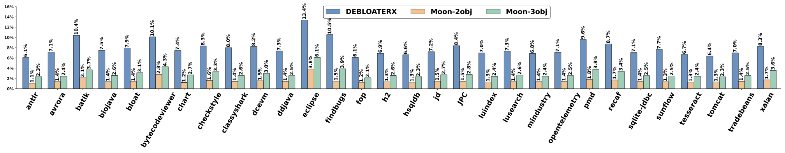

# Towards a Theoretically-Backed and Practical Framework for Selective Object-Sensitive Pointer Analysis (Artifact Document)

## 1. Introduction

This artifact supports reproducing the results of all research questions (RQ1-RQ4) in Section 6 of our PLDI'25 paper, including all associated tables and figures.

To comprehensively evaluate the effectiveness of Moon and compare it against other state-of-the-art approaches for pointer analysis ([Cut-Shortcut](https://dl.acm.org/doi/10.1145/3591242), [Zipper](https://dl.acm.org/doi/10.1145/3276511), [Conch](https://ieeexplore.ieee.org/document/9678880), [DebloaterX](https://dl.acm.org/doi/10.1145/3622832)), we implemented Moon within the Qilin framework.

### 1.1 Benchmarks

Details of all benchmarks can be found in *artifact/util/benchmark.py*, including their names and jar paths for analysis.

## 2. Getting Started Guide

### 2.1 Directory Structure

Since Moon was implemented in the Qilin framework, the directory structure remains largely consistent with Qilin. Here, we introduce the newly added approaches: Moon and Cut-Shortcut.

#### 2.1.1 Moon

The source code for Moon is located in *qilin/pta/toolkit/moon*.

#### 2.1.2 Cut-Shortcut

The source code for Cut-Shortcut builds upon the version in Tai-e, with modifications for Qilin. It is located in *qilin/core/solver/csc*.

### 2.2 Basic Commands

#### Building Runnable Jars

In the root directory of this repository, execute:
```shell
./gradlew clean fatjar
```
This produces an executable jar in the *artifact/* directory, requiring JDK 16 or higher.

#### 2.2.1 Running Benchmarks (for RQ1-RQ3)

##### Moon
```shell
cd artifact
python run.py {benchmark_name} {sensitivity} -print -cd -cda=MOON
```
- Available sensitivities: *2o* (2obj-sensitivity) and *3o* (3obj-sensitivity).  
- Benchmark names are listed in *artifact/util/benchmark.py*.

##### Cut-Shortcut
```shell
cd artifact
python run.py {benchmark_name} csc -print
```
- Benchmark names are listed in *artifact/util/benchmark.py*.

##### Zipper
```shell
cd artifact
python run.py {benchmark_name} {sensitivity} -print
```
- Available sensitivities: *Z-2o* (2obj-sensitivity) and *Z-3o* (3obj-sensitivity).  
- Benchmark names are listed in *artifact/util/benchmark.py*.

##### Conch
```shell
cd artifact
python run.py {benchmark_name} {sensitivity} -print -cd -cda=CONCH
```
- Available sensitivities: *2o* and *3o*.  
- Benchmark names are listed in *artifact/util/benchmark.py*.

##### DebloaterX
```shell
cd artifact
python run.py {benchmark_name} {sensitivity} -print -cd -cda=DEBLOATERX
```
- Available sensitivities: *2o* and *3o*.  
- Benchmark names are listed in *artifact/util/benchmark.py*.

#### Running All Benchmarks for All Approaches

To execute all benchmarks with all approaches, including context-insensitive pointer analysis:
```shell
cd artifact
python qilinDriverForAll.py
```
This command runs:
1. Context-insensitive pointer analysis.
2. Cut-Shortcut.
3. Zipper (2obj-sensitive and 3obj-sensitive).
4. Conch (2obj-sensitive and 3obj-sensitive).
5. DebloaterX (2obj-sensitive and 3obj-sensitive).
6. Moon (2obj-sensitive and 3obj-sensitive).

For all 30 benchmarks.

#### 2.2.2 Ablation Experiments (for RQ4)

##### MOONu
```shell
cd artifact
python run.py {benchmark_name} {sensitivity} -print -cd -cda=MOONu
```
##### MOONuh
```shell
cd artifact
python run.py {benchmark_name} {sensitivity} -print -cd -cda=MOONuh
```
##### MOONuf
```shell
cd artifact
python run.py {benchmark_name} {sensitivity} -print -cd -cda=MOONuf
```

- Sensitivities: *2o* and *3o*.  
- Benchmark names are listed in *artifact/util/benchmark.py*.

#### Running All Benchmarks for Ablation

To execute all ablation experiments:
```shell
cd artifact
python qilinDriverForMoonAblation.py
```

## 3. Tables and Figures

### 3.1 Tables

- Table 1: [Experiment details for 2obj-sensitive pointer analysis](data/experiment-2obj.tex)  
- Table 2: [Experiment details for 3obj-sensitive pointer analysis](data/experiment-3obj.tex)  
- Table 3: [Pre-analysis time comparison](data/preanalysis_time_comparison.tex)

### 3.2 Figures

- Figure 1: Precision comparison of all approaches under 2obj-sensitive analysis  
  
- Figure 2: Efficiency comparison of all approaches under 2obj-sensitive analysis  
  
- Figure 3: Precision comparison of all approaches under 3obj-sensitive analysis  
  
- Figure 4: Efficiency comparison of all approaches under 3obj-sensitive analysis  
  
- Figure 5: Percentage of Precision-Relevant Heaps identified by Moon (2obj and 3obj).  
  
- Figure 6: Comparison of Precision-Relevant Heaps identified by Moon and DebloaterX (2obj and 3obj).  
  
- Figure 7: Distribution of Precision-Relevant Heaps identified by Moon (2obj-sensitive).  
  
- Figure 8: Distribution of Precision-Relevant Heaps identified by Moon (3obj-sensitive).  
  
- Figure 9: Precision comparison with different Precision-Relevant Heaps identified by Moon (3obj-sensitive).  
  
- Figure 10: Speedup comparison with different Precision-Relevant Heaps identified by Moon (3obj-sensitive).  
  
